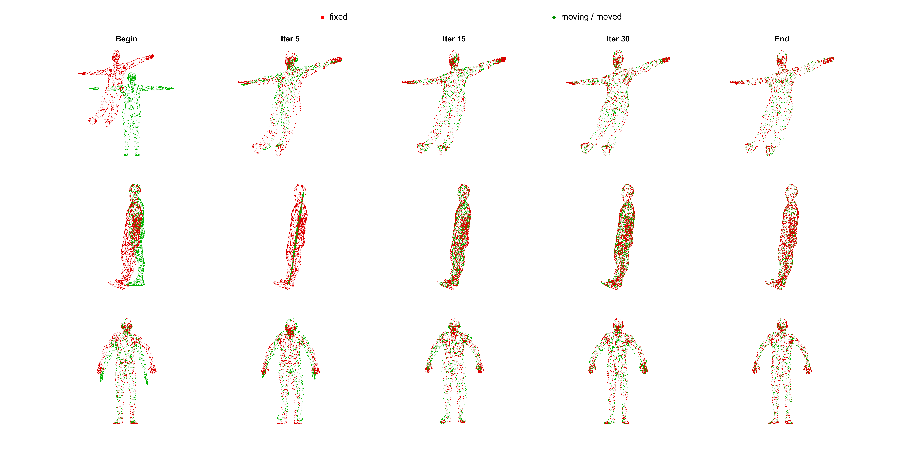

# Analytic-CPD

This repository provides a C++ research prototype implementation of our paper:

**"Structured Analytic Coherent Point Drift for Non-Rigid Point Set Registration"**

The proposed method is referred to as **Analytic-CPD**.

Analytic-CPD is an unsupervised non-rigid point set registration framework that combines the Gaussian-mixture posterior correspondence mechanism of Coherent Point Drift (CPD) with Structured Analytic Mappings (SAM). The method preserves the probabilistic soft-correspondence layer of CPD, but replaces the point-indexed Gaussian-kernel displacement M-step with structured analytic mapping estimation.

The current release focuses on the core algorithmic pipeline and selected reproducibility examples.

---

## Overview

Standard non-rigid CPD estimates a point-indexed Gaussian-kernel displacement field. In contrast, Analytic-CPD estimates deformation in a finite-dimensional structured analytic function space. The deformation coefficient dimension is governed by the ambient dimension and analytic order rather than directly by the number of moving points.

At each iteration, Analytic-CPD:

1. Computes CPD-style posterior correspondences;
2. Condenses posterior statistics into weighted soft targets;
3. Solves a weighted structured analytic mapping fitting problem;
4. Updates the moving point set compositionally;
5. Increases the analytic degree progressively according to a continuation schedule.

This design allows low-order analytic maps to stabilize early posterior correspondences and higher-order modes to refine nonlinear residual deformation later.

---
## Representative Registration Examples

<p align="center">
  
</p>

**Figure.** Three-dimensional large-deformation registration examples using
Analytic-CPD. Red points denote the fixed point set, and green points denote the
moving/moved point set. The first two rows show controlled SHREC'19 human
point-cloud cases, and the third row shows a registered MPI-FAUST human-motion
case.

---
## Project Structure

The current Visual Studio implementation follows a three-layer architecture:

- **`Analytic_CPD.dll`**  
  Core Analytic-CPD algorithm. It implements CPD-style posterior computation, posterior-weighted analytic fitting, compositional point-set update, variance update, and increasing-degree continuation.

- **`SmoothAdjustment.dll`**  
  A lightweight wrapper and file-level interface. It loads `Analytic_CPD.dll`, reads point sets from files, calls the 2D/3D registration interfaces, and writes the registered moving point set to CSV.

- **`Test.exe`**  
  A console frontend for running examples. It reads `experiment.ini` and `ACPD.ini`, initializes the DLLs, runs either 2D or 3D registration, and writes output files.

A typical runtime directory should contain:

```text
Test.exe
SmoothAdjustment.dll
Analytic_CPD.dll
experiment.ini
ACPD.ini
```
---

## Build Environment

The current implementation is a Windows / Visual Studio research prototype.

Tested environment:

- Windows
- Microsoft Visual Studio
- 64-bit build
- Eigen
- Standard C++ / STL

OpenCV is not required for the minimal console registration example unless additional visualization modules are enabled.

Linux, macOS, and CMake support are not yet provided in the current release.

---

## Configuration Files

The program uses two configuration files.

### `experiment.ini`

This file controls input/output paths and experiment mode.

```ini
[Param]
; 0: 2D registration, 1: 3D registration
RegistType=1

; 1: generate a synthetic analytic deformation before registration, 0: direct registration
AddPerturb=0

; input point sets
MovingPsPath=examples/3d/moving.csv
FixedPsPath=examples/3d/fixed.csv

; output files
MovedOutputPath=results/moved3d.csv
DeformedOutputPath=results/deformed3d.csv

; perturbation degrees used only when AddPerturb=1
PerturbDeg2D=8
PerturbDeg3D=2
```
## `ACPD.ini`

This file controls Analytic-CPD algorithm parameters.

```ini
[Param]
; maximum analytic degree
Deg=10

; maximum number of CPD iterations
maxIterCount=55

; CPD outlier weight
Omega=0.1

; convergence tolerance
Eps=0.00001

; output file for error-time curve
OutputErrorTime=results/analytic_cpd_error_time.csv
```
---

## Quick Start

1. Build the Visual Studio solution in **Release x64** mode.

2. Copy the following files into the same runtime directory:

   ```text
   Test.exe
   SmoothAdjustment.dll
   Analytic_CPD.dll
   experiment.ini
   ACPD.ini
   ```
3. Edit `experiment.ini` to specify the fixed point set, moving point set, and output path.

4. Edit `ACPD.ini` to specify Analytic-CPD parameters.

5. Run:

   ```bash
   Test.exe
   ```
   After execution, the registered moving point set will be written to the path specified by `MovedOutputPath`, and the error-time curve will be written to the path specified by `OutputErrorTime`.

---

## Input Data Format

Input point sets are stored as CSV files without headers.

For 2D point sets:

```text
x,y
x,y
...
 ```
For 3D point sets:

```text
x,y,z
x,y,z
...
```
Each row corresponds to one point.

For pointwise RMSE evaluation, the fixed and moving point sets should contain the same number of points and follow the same point ordering. For general registration without known correspondence, the output registered point set can still be visually inspected or evaluated using nearest-neighbor metrics.

---

## Output Files

The program produces the registered moving point set:

```text
results/moved3d.csv
```
or the path specified by `MovedOutputPath`.

The program also produces the error-time curve:

```text
results/analytic_cpd_error_time.csv
```
The error-time file is useful for plotting convergence curves and comparing runtime behavior.

---

## Current Status

This repository is currently a research prototype accompanying the paper.

Current characteristics:

- C++ implementation
- Windows / Visual Studio project
- Direct posterior computation
- Exact weighted structured analytic fitting
- Single-machine CPU implementation
- No GPU acceleration
- No fast Gaussian transform or low-rank posterior acceleration
- Selected examples are provided for demonstrating the core algorithm

The code is being organized for reproducibility. Additional examples, scripts, and documentation will be added progressively.

---

## Datasets

The paper uses several public datasets and generated deformation instances. Due to dataset license restrictions, third-party datasets such as FAUST, SHREC, Stanford Bunny, and MedShapeNet should be downloaded from their original sources.

This repository will provide selected toy examples and scripts for preprocessing, deformation generation, registration, and evaluation where possible.

---

## Notes on Reproducibility

The current implementation is intended to reproduce the core Analytic-CPD pipeline and selected experiments.

Full reproduction of all experiments in the paper may require:

- Downloading third-party datasets from their official sources
- Applying the same normalization and preprocessing steps
- Using the provided configuration files
- Running the corresponding evaluation scripts

---

## Citation

If you use this code, please cite:

```bibtex
@article{feng2026structuredanalyticcpd,
  title={Structured Analytic Coherent Point Drift for Non-Rigid Point Set Registration},
  author={Feng, Wei and Zheng, Haiyong},
  journal={arXiv preprint arXiv:2605.00934},
  year={2026},
  doi={10.48550/arXiv.2605.00934}
}
```
Please also cite the related Structured Analytic Mappings paper if you use the SAM deformation model.

---

## License

A formal open-source license will be added after the third-party dependency status is fully clarified.

Until then, please treat this repository as a research prototype made publicly available for academic reference. For redistribution, commercial use, or integration into other projects, please contact the authors and review all third-party code notices carefully.

---

## Contact

For questions, comments, or collaboration related to Analytic-CPD, structured analytic mappings, point set registration, or geometric deformation modeling, please contact the author through GitHub.
